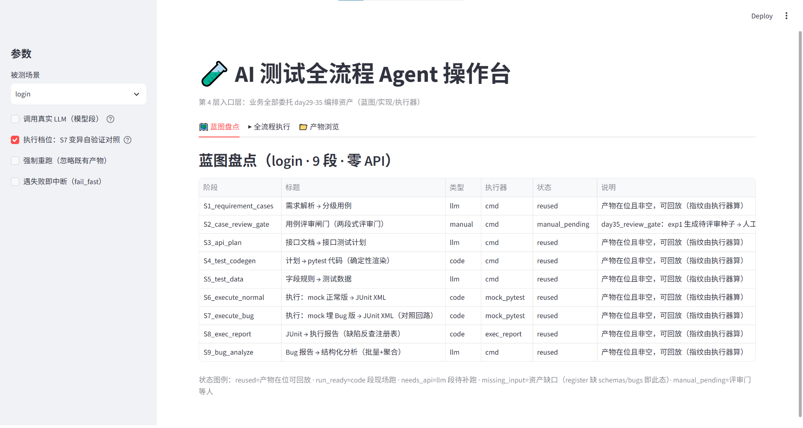
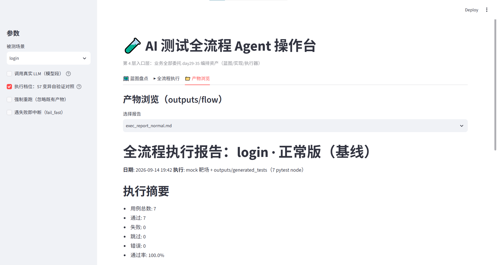

# AI 测试辅助 Agent

> 用 **Cursor + Gemini + LangChain** 搭建的软件测试辅助 Agent。
> 学习项目：6 周计划，当前进度 **第 6 周（Day 39：测试 + 文档）**。

## 这是什么

把"测试工作流"拆成 **9 段流水线**，每段只做一件事，可单独跑、可断点续跑：

```
docs（需求 / 接口 / schema / Bug）
  → S1  需求解析 → 分级用例        (LLM)
  → S2  用例评审门                 (人工)
  → S3  接口文档 → 测试计划        (LLM)
  → S4  计划 → pytest 套件         (本地)
  → S5  字段规则 → 测试数据        (LLM)
  → S6  执行正常版 → JUnit XML     (本地)
  → S7  执行埋 Bug 对照版 → JUnit  (本地)
  → S8  JUnit → 执行报告           (本地)
  → S9  Bug 报告 → 分析建议        (LLM)
  → outputs/（报告 / JUnit / 生成的套件）
```

**关键设计：只有 S1 / S3 / S5 / S9 需要 `GEMINI_API_KEY`；S4 / S6 / S7 / S8 是纯本地段**
（渲染 pytest 代码 + mock 接口 + 真跑 pytest）——**没有 API Key 也能跑通整条"代码链"**。

## 功能列表

| 功能 | 段 | 需要 API | 入口 |
|---|---|---|---|
| 需求文档 → 分级测试用例（正向 / 边界 / 异常 / 安全） | S1 | ✅ | CLI `run` · UI |
| 用例评审门（两段式：预览 → 入库） | S2 | ❌ 人工 | 人工 |
| 接口文档 → pytest 接口测试计划 | S3 | ✅ | CLI `run --stage S3` · UI 多选 |
| 计划 → 可执行 pytest 套件（含 `conftest.py`） | S4 | ❌ | 自动 |
| 字段规则 → 测试数据（边界 / 异常 / SQL / Mock JSON） | S5 | ✅ | 自动 |
| 执行（正常版 / 埋 Bug 对照版）→ JUnit XML | S6 / S7 | ❌ | 自动 |
| JUnit → Markdown 执行报告 | S8 | ❌ | CLI `report` |
| Bug 报告 → 复现步骤 + 加固建议 | S9 | ✅ | 自动 |
| 资产盘点（零 API）：产物在位 → `reused` 断点续跑 | 全部 | ❌ | CLI `scan` · UI |
| **只跑指定阶段**：自动补齐上游依赖闭包 | 任意 | 视段 | CLI `run --stage S4,S8` · UI 多选 |

### 界面截图





## 快速开始

### 1. 环境

```bash
cd ai_test_agent
python -m venv .venv
.venv\Scripts\activate            # Windows；macOS/Linux: source .venv/bin/activate
pip install -r requirements.txt
python check_env.py               # 环境自检
```

### 2. 配置

在项目根新建 `.env`：

```ini
GEMINI_API_KEY=你的key             # 仅 S1/S3/S5/S9 需要；只跑代码链可以不填
# 可选：走本地代理
HTTPS_PROXY=http://127.0.0.1:7890
```

模型：主 `gemini-3.5-flash-lite`；备 `gemini-3.1-flash-lite`（fallback 前缀 `google_genai:`）。

### 3. 跑起来（两种入口任选）

**A. 命令行**

```bash
python cli.py --help                                 # 三个子命令：scan / run / report
python cli.py scan   --scenario login                # ① 盘点 9 段资产状态（零 API）
python cli.py scan   --scenario login --no-bug-probe  #    关掉 S7 对照回路 → 8 段
python cli.py run    --scenario login                # ② 执行（零 API：只跑 S4/S6/S7/S8）
python cli.py run    --scenario login --with-llm     #    真 API：补跑 S1/S3/S5/S9
python cli.py run    --scenario login --stage S8     #    只跑某段（自动补齐依赖上游）
python cli.py report --name exec_report_normal.md    # ③ 看报告
```

**B. Web 界面**

```bash
streamlit run ui/app.py
```

打开后：
- 「🗺️ 蓝图盘点」：9 段资产状态一览（零 API）。
- 「▶ 全流程执行」：**「只跑指定阶段」留空 = 全跑**；选 `S8_exec_report` → 页面提示「子集执行：5 段（自动补齐上游 4 段）」→ 点「执行」。
- 「📁 产物浏览」：直接读 `outputs/flow` 下的报告。

## 项目结构

```
ai_test_agent/
├── cli.py                     # 命令行入口（Click：scan / run / report，薄入口层）
├── ui/app.py                  # Web 入口（Streamlit 薄 UI：只调资产，不写业务）
├── check_env.py               # 环境自检
├── src/agent/                 # 全部实现（平铺 + 裸 import：from dayXX_yyy import ...）
│   ├── day29–day33 系列       # 五专项：需求→用例 / 接口→代码 / Bug 分析 / 造数 / 回归+报告
│   ├── day34_flow_map.py      # 蓝图与盘点（9 段 StageSpec + 五态 ScanStatus）
│   ├── day34_orchestrator.py  # 执行器 run_flow（断点续跑 / 指纹 / 失败隔离）
│   ├── day35_scenario.py      # 场景工厂 build_blueprint / scan_blueprint / select_stages
│   ├── day35_review_gate.py   # 两段式评审门
│   └── utils.py               # 公共工具（日志 / 文本 / ROOT）
├── tests/                     # pytest（全部零 API）
├── docs/                      # 资产：requirements / apis / schemas / bugs / cases
├── outputs/                   # 产物：flow 报告 / JUnit / 生成的套件
├── archive/                   # 历史练习（week1..week5，不参与测试收集）
└── pyproject.toml             # pyright(extraPaths + venvPath/venv) + pytest(pythonpath / testpaths)
```

## 测试

```bash
.venv\Scripts\python.exe -m pytest -q        # 全绿：51 passed（约 11–13 秒，其中两个 UI AppTest 文件占 ≈10 秒）
.venv\Scripts\python.exe -m pytest -v        # 看每条用例名
```

- **覆盖**：蓝图工厂（9 段 / 档位 8 段 / 对象新鲜性）、盘点五态、依赖闭包（顺序守恒 / 拓扑序 / 边界）、
  蓝图契约（输出唯一性 / 路径规范化）、CLI 参数与零 API 路径、
  UI 渲染（Streamlit `AppTest`）、UI 选段（选项 = 精确 `stage_id` / 空选 = 全流程 / S8 闭包预览 / 换档位清空选择）。
- **纪律**：套件内所有测试**零 API**（不调模型、不起真实 mock 服务）；真跑留人工验收。
- `testpaths = ["tests"]`：`archive/`、`src/`、`outputs/` 下的历史脚本**不再**被 pytest 误收集。

## 文档索引

| 文档 | 内容 |
|---|---|
| `HANDOFF.md` | 会话交接：当前阶段、分界线与已知约定 |
| `docs/architecture.md` | 架构与目录（第 1 周版本，待续写） |
| `docs/dayXX_notes.md` | 每日笔记（Day 8 – Day 39） |

## 已知局限

- `register` 场景缺 `docs/schemas/register.json` 与 `docs/bugs/register_bugs.md`
  → 盘点时 S5 / S9 报 `missing_input`（缺资产就该说缺，不是 bug）。
- S2 评审门是**人工段**，盘点永远 `manual_pending`（设计如此）。
- UI 的选段只接受**精确 `stage_id`**（多选框给的就是精确 id）；`S4` 这种"唯一前缀"只有 CLI `--stage` 支持
  —— UI **不做前缀猜谜**（见决策 J），这是刻意的不对称，不是缺功能。
- 执行层暂无 `skipped_missing_input` 态：输入缺失的 code 段会真跑并 `run_failed`（已列入待办）。
- `docs/` 多为演示样例数据，非生产资产。

---
*最后更新：2026-09-15（Day 39：测试 + 文档；UI 补选段）*