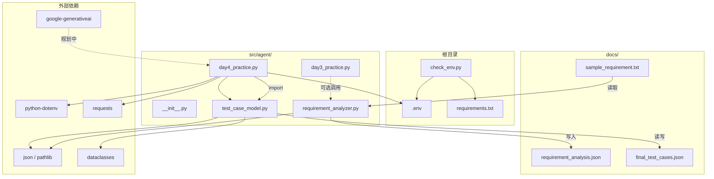

# AI 测试辅助 Agent — 项目架构文档

## 1. 项目结构树

```
ai_test_agent/
├── .env                          # 环境变量（API Key，不提交 Git）
├── .gitignore                    # Git 忽略规则
├── README.md                     # 项目说明与快速开始
├── requirements.txt              # Python 依赖清单
├── check_env.py                  # 环境检查脚本（根目录工具）
│
├── docs/                         # 文档与运行产物
│   ├── architecture.md           # 本架构文档
│   ├── sample_requirement.txt    # 示例需求文档（用户登录）
│   ├── requirement_analysis.json # 需求分析结果（JSON）
│   ├── analysis_result.json      # 需求分析结果（JSON）
│   ├── sample_test_cases.json    # 示例测试用例（JSON）
│   ├── final_test_cases.json     # 完整测试用例集（JSON）
│   ├── day4_test_cases.json      # Day4 练习产出（JSON）
│   └── agent.log                 # Agent 运行日志
│
├── src/
│   └── agent/                    # 核心业务模块包
│       ├── __init__.py           # 包初始化与模块说明
│       ├── requirement_analyzer.py  # 需求文档分析
│       ├── test_case_model.py       # 测试用例数据模型与管理
│       ├── day3_practice.py         # Day3 语法练习（推导式/类型/异常/IO）
│       └── day4_practice.py         # Day4 语法练习（dataclass/JSON/HTTP/配置）
│
└── tests/                        # 单元测试目录（预留，待补充）
```

> 说明：`.venv/` 为本地虚拟环境，已在 `.gitignore` 中排除。

---

## 2. 模块功能说明

### 2.1 根目录

| 文件 | 类型 | 功能 |
|------|------|------|
| `check_env.py` | 工具脚本 | 检查 Python 版本、虚拟环境、`.env`、`requirements.txt` 及核心依赖（`requests`、`dotenv`）是否就绪 |
| `requirements.txt` | 配置 | 项目依赖：`google-generativeai`、`python-dotenv`、`requests`、`pydantic` 等 |
| `.env` | 配置 | 存放 `GEMINI_API_KEY`、`LANGCHAIN_API_KEY` 等敏感配置 |
| `README.md` | 文档 | 项目简介、技术栈、快速开始指南 |

### 2.2 `src/agent/` 核心包

| 模块 | 功能 | 主要导出 |
|------|------|----------|
| `__init__.py` | Agent 核心包入口，声明模块用途 | — |
| `requirement_analyzer.py` | 读取 `.txt` 需求文档，统计字数/行数，提取含规则关键词的行，输出 JSON 分析结果 | `analyze_requirement()` |
| `test_case_model.py` | 测试用例领域模型：`TestCase` dataclass + `TestCaseManager` 增删查、JSON 持久化、按优先级统计 | `TestCase`, `TestCaseManager` |
| `day3_practice.py` | **学习模块**：列表/字典推导式、类型注解、`TypedDict`、`try/except`、文件读写、需求分析器调用示例 | 练习代码（非生产入口） |
| `day4_practice.py` | **学习模块**：dataclass 序列化、LLM JSON 解析、环境变量配置、`requests` HTTP 测试、集成 `TestCaseManager` | 练习代码 + 里程碑演示 |

### 2.3 `docs/` 数据与文档

| 文件 | 用途 |
|------|------|
| `sample_requirement.txt` | 用户登录功能的示例需求，供 `requirement_analyzer` 分析 |
| `*_analysis.json` | 需求分析结构化输出 |
| `*_test_cases.json` | 测试用例 JSON 持久化文件 |
| `agent.log` | 运行日志 |

### 2.4 规划中的能力（README 已描述，代码待扩展）

| 能力 | 目标技术 | 当前状态 |
|------|----------|----------|
| 测试用例 AI 生成 | Gemini + LangChain | 占位/练习代码，未独立成模块 |
| Bug 分析 Agent | Gemini | 待实现 |
| 接口自动化测试 | `requests` | `day4_practice.py` 中有 API 测试练习代码 |

---

## 3. 模块依赖关系

### 3.1 依赖关系图



**图例：** 实线 = 已实现依赖；虚线 = 可选或规划中。

### 3.2 模块间依赖表

| 调用方 | 被依赖方 | 关系说明 |
|--------|----------|----------|
| `day3_practice.py` | `requirement_analyzer.py` | 可选（代码中已注释），演示需求分析流程 |
| `day4_practice.py` | `test_case_model.py` | 直接 import，演示用例管理与 JSON 持久化 |
| `requirement_analyzer.py` | — | **独立模块**，仅依赖标准库 |
| `test_case_model.py` | — | **独立模块**，仅依赖标准库 |
| `check_env.py` | — | **独立脚本**，不依赖 `src/agent` |
| `day3_practice.py` | `day4_practice.py` | 无依赖（并列学习模块） |

### 3.3 典型数据流

```
需求文档 (.txt)
    │
    ▼  analyze_requirement()
需求分析结果 (.json)          TestCase 对象
    │                              │
    │                              ▼  save_to_json()
    │                         测试用例文件 (.json)
    │                              │
    └──────────► (未来) Gemini Agent ◄── load_from_json()
                      生成/补充用例
```

---

## 4. 如何使用本项目

### 4.1 环境准备

```bash
# 1. 进入项目目录
cd ai_test_agent

# 2. 创建并激活虚拟环境（Windows PowerShell）
python -m venv .venv
.venv\Scripts\Activate.ps1

# 3. 安装依赖
pip install -r requirements.txt

# 4. 配置 API Key（编辑 .env）
# GEMINI_API_KEY=your_api_key_here
# LANGCHAIN_API_KEY=your_key_here

# 5. 验证环境
python check_env.py
```

### 4.2 需求文档分析

```bash
# 在项目根目录执行
python -c "
from src.agent.requirement_analyzer import analyze_requirement
result = analyze_requirement(
    'docs/sample_requirement.txt',
    'docs/requirement_analysis.json',
)
print(result)
"
```

**输出字段：** `filepath`、`char_count`、`line_count`、`keywords`、`keyword_lines`

### 4.3 测试用例管理

```bash
# 运行内置示例（添加用例 → 查询 → 保存 → 加载）
python src/agent/test_case_model.py
```

**代码调用示例：**

```python
from src.agent.test_case_model import TestCase, TestCaseManager

manager = TestCaseManager()
manager.add_case(TestCase(
    id="TC-001",
    title="用户登录正常流程",
    steps=["打开登录页", "输入账号密码", "点击登录"],
    expected_result="跳转首页",
    priority="P0",
))
print(manager.find_by_priority("P0"))
print(manager.count_by_priority())   # {"P0": 1}
manager.save_to_json("docs/final_test_cases.json")
```

### 4.4 学习模块运行

| 命令 | 说明 |
|------|------|
| `python src/agent/day3_practice.py` | Day3 练习（需取消注释对应章节） |
| `python src/agent/day4_practice.py` | Day4 练习 + TestCaseManager 里程碑演示 |

> 练习文件中大量代码默认注释，按需取消注释后运行。

### 4.5 推荐工作流

1. 用 `check_env.py` 确认环境正常  
2. 在 `docs/sample_requirement.txt` 编写或粘贴需求  
3. 调用 `analyze_requirement()` 提取规则行  
4. 用 `TestCaseManager` 管理/持久化测试用例  
5. （后续）接入 Gemini，基于需求与分析结果自动生成用例  

---

## 5. 架构设计原则

| 原则 | 说明 |
|------|------|
| 模块化 | 需求分析（`requirement_analyzer`）与用例管理（`test_case_model`）相互独立 |
| 数据驱动 | 需求、用例、分析结果均以 JSON/TXT 文件交换，便于 Agent 读写 |
| 渐进式 | `day3/day4_practice` 为学习代码，核心能力逐步沉淀到独立模块 |
| 类型安全 | 核心模块使用 dataclass + 类型注解，降低测试数据出错概率 |

---

## 6. 后续扩展建议

- 新增 `src/agent/llm/`：封装 Gemini 调用  
- 新增 `src/agent/agents/`：LangChain Agent 编排（用例生成、Bug 分析）  
- 补充 `tests/`：为 `requirement_analyzer`、`test_case_model` 编写 pytest 用例  
- 统一 CLI 入口：如 `python -m src.agent.cli analyze / generate`
