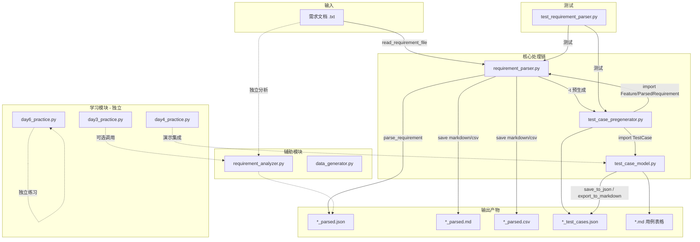
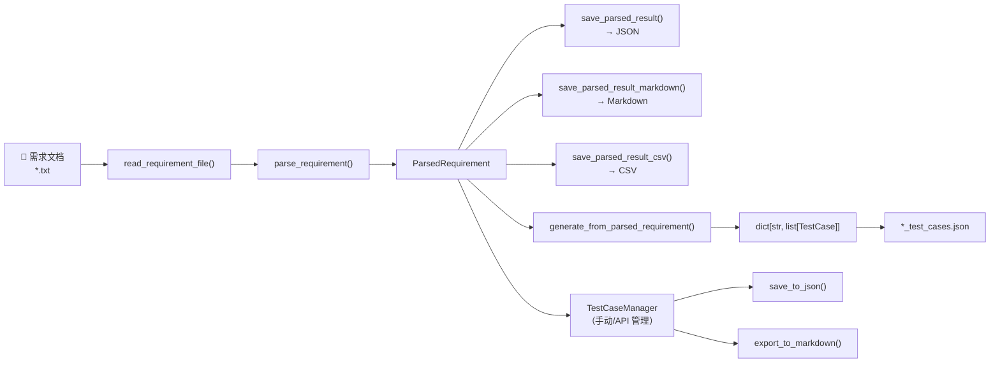

# AI 测试辅助 Agent — 项目架构文档

> 最后更新：第 1 周完成。使用说明详见 [README.md](../README.md)。

---

## 1. 目录结构树

```
ai_test_agent/
├── .env                              # 环境变量（API Key，不提交 Git）
├── .gitignore                        # Git 忽略规则
├── README.md                         # 项目说明、功能列表、命令行用法
├── requirements.txt                  # Python 依赖清单
├── check_env.py                      # 环境检查脚本
│
├── docs/                             # 文档、需求样本与运行产物
│   ├── architecture.md               # 本架构文档
│   ├── requirement.txt               # 主示例需求（电商：注册/搜索/订单）
│   ├── requirement_ecommerce.txt     # 电商系统需求样本
│   ├── requirement_education.txt     # 在线教育平台需求样本
│   ├── requirement_social.txt        # 社交聊天应用需求样本
│   ├── sample_requirement.txt        # 用户登录简版需求
│   ├── parsed_requirement.json       # 解析结果（JSON）
│   ├── parsed_requirement.md         # 解析结果（Markdown）
│   ├── parsed_requirement.csv        # 解析结果（CSV）
│   ├── parsed_requirement_test_cases.json  # 预生成边界用例
│   ├── *_parsed.json                 # 各需求文件的批量解析产物
│   ├── sample_test_cases.json        # 测试用例示例
│   ├── sample_test_cases.md          # 测试用例 Markdown 导出
│   └── final_test_cases.json         # 完整测试用例集
│
├── src/
│   └── agent/                        # 核心业务模块包
│       ├── __init__.py               # 包初始化
│       ├── requirement_parser.py     # ★ 需求解析器（CLI 入口）
│       ├── requirement_analyzer.py   # 需求文本统计分析
│       ├── test_case_model.py        # ★ 测试用例数据模型与管理
│       ├── test_case_pregenerator.py # ★ 边界值用例预生成器
│       ├── data_generator.py         # 测试数据随机生成器
│       ├── day3_practice.py          # Day3 学习练习
│       ├── day4_practice.py          # Day4 学习练习
│       ├── day6_practice.py          # Day6 正则练习
│       └── bug_demo.py               # 故意含 Bug 的演示脚本
│
└── tests/                            # pytest 单元测试
    ├── test_basic.py                 # pytest 入门练习
    └── test_requirement_parser.py    # 需求解析器与输出格式测试
```

> `.venv/` 为本地虚拟环境，已在 `.gitignore` 中排除。

---

## 2. Python 文件功能说明

### 2.1 根目录

| 文件 | 类型 | 功能说明 |
|------|------|----------|
| `check_env.py` | 工具脚本 | 检查 Python 版本、虚拟环境、`.env`、`requirements.txt`，验证 `requests` 和 `dotenv` 是否可导入 |

### 2.2 `src/agent/` — 生产模块

| 文件 | 功能说明 | 主要导出 |
|------|----------|----------|
| `__init__.py` | Agent 核心包入口，声明模块用途 | — |
| `requirement_parser.py` | **需求解析核心**：按「XX功能：」分段，提取子功能与约束条件；支持 CLI 单文件/批量解析；输出 JSON / Markdown / CSV；可选 `-t` 触发用例预生成 | `Feature`, `ParsedRequirement`, `parse_requirement()`, `batch_parse()`, `main()` |
| `requirement_analyzer.py` | **需求文本分析**：统计字数/行数，用列表推导式提取含关键词（必须、不少于等）的规则行，写入 JSON | `analyze_requirement()` |
| `test_case_model.py` | **测试用例管理**：`TestCase` dataclass；`TestCaseManager` 提供增删查、按优先级/类型筛选、统计、JSON 读写、Markdown 表格导出 | `TestCase`, `TestCaseManager` |
| `test_case_pregenerator.py` | **用例预生成**：根据 `ParsedRequirement` 为每条约束生成边界值测试框架；支持区间（1-150）、下限（不少于）、上限（不超过）等策略 | `generate_boundary_cases()`, `generate_from_parsed_requirement()` |
| `data_generator.py` | **测试数据生成**：按字段定义批量生成随机字符串、邮箱、手机号、数字等测试数据 | `TestDataGenerator` |

### 2.3 `src/agent/` — 学习 / 演示模块

| 文件 | 功能说明 |
|------|----------|
| `day3_practice.py` | Day3 练习：推导式、类型注解、`TypedDict`、`try/except`、文件读写、10 道练习题 |
| `day4_practice.py` | Day4 练习：dataclass 序列化、LLM JSON 安全解析、环境变量配置、`requests` HTTP 测试；集成 `TestCaseManager` 里程碑演示 |
| `day6_practice.py` | Day6 练习：正则表达式（邮箱提取、数字提取、功能名/子功能分离），含 `Feature` dataclass 与 JSON 持久化练习 |
| `bug_demo.py` | 故意包含 Bug 的短脚本，用于演示调试流程（访问不存在的属性） |

### 2.4 `tests/` — 单元测试

| 文件 | 功能说明 |
|------|----------|
| `test_basic.py` | pytest 入门：断言、异常、`pytest.raises` 等基础用法练习 |
| `test_requirement_parser.py` | 需求解析器测试：功能分段、子功能/约束提取、完整解析、Markdown/CSV 输出、数字提取 |

---

## 3. 模块依赖关系

### 3.1 依赖关系图



**图例：** 实线 = 生产链路依赖；虚线 = 辅助/学习/可选依赖。

### 3.2 模块间依赖表

| 调用方 | 被依赖方 | 依赖类型 |
|--------|----------|----------|
| `requirement_parser.py` | `test_case_pregenerator.py` | CLI `-t` 时动态 import |
| `test_case_pregenerator.py` | `requirement_parser.py` | 使用 `Feature`, `ParsedRequirement` |
| `test_case_pregenerator.py` | `test_case_model.py` | 使用 `TestCase` |
| `day4_practice.py` | `test_case_model.py` | 里程碑演示 |
| `bug_demo.py` | `test_case_model.py` | Bug 演示 |
| `test_requirement_parser.py` | `requirement_parser.py` | 单元测试 |
| `test_requirement_parser.py` | `test_case_pregenerator.py` | 数字提取测试 |
| `requirement_analyzer.py` | — | **独立**，仅标准库 |
| `test_case_model.py` | — | **独立**，仅标准库 |
| `data_generator.py` | — | **独立**，仅标准库 |
| `check_env.py` | — | **独立**，不依赖 `src/agent` |

### 3.3 依赖分层

```
┌─────────────────────────────────────────────┐
│  CLI 入口：requirement_parser.main()         │
├─────────────────────────────────────────────┤
│  业务层：test_case_pregenerator              │
│          test_case_model                     │
├─────────────────────────────────────────────┤
│  解析层：requirement_parser                  │
│          requirement_analyzer（并行独立）     │
├─────────────────────────────────────────────┤
│  工具层：data_generator / check_env          │
├─────────────────────────────────────────────┤
│  标准库：re, json, dataclasses, argparse    │
└─────────────────────────────────────────────┘
```

---

## 4. 数据流图

### 4.1 主流程：需求文档 → 解析 → 输出



### 4.2 逐步数据变换

| 步骤 | 输入 | 处理 | 输出数据结构 |
|------|------|------|-------------|
| 1. 读取 | `docs/requirement.txt` | `read_requirement_file()` | 原始文本 `str` |
| 2. 分段 | 原始文本 | `split_by_features()` | `[(功能名, 描述), ...]` |
| 3. 提取 | 功能描述 | `extract_sub_features()` + `extract_constraints()` | 子功能列表 + 约束列表 |
| 4. 组装 | 分段结果 | `parse_requirement()` | `ParsedRequirement` 对象 |
| 5a. 输出 JSON | `ParsedRequirement` | `save_parsed_result()` | `*_parsed.json` |
| 5b. 输出 MD/CSV | `ParsedRequirement` | `save_*_markdown/csv()` | `*_parsed.md` / `*.csv` |
| 6. 预生成 | `ParsedRequirement` | `generate_from_parsed_requirement()` | 按功能分组的 `TestCase` 列表 |
| 7. 持久化 | `TestCase` 列表 | `json.dump(asdict(...))` | `*_test_cases.json` |

### 4.3 `ParsedRequirement` 数据结构

```
ParsedRequirement
├── features: list[Feature]
│   └── Feature
│       ├── feature: str          # 功能名称，如 "用户注册"
│       ├── sub_features: list    # ["支持手机号注册", "需要短信验证码验证"]
│       ├── constraints: list     # ["密码不少于8位", "年龄必须在1-150之间"]
│       └── raw_text: str         # 原始描述文本
├── source_file: str
├── total_features: int
└── total_constraints: int
```

### 4.4 边界用例预生成数据流

```
约束条件 "年龄必须在1-150之间"
    │
    ▼  _extract_range()  →  (1, 150)
    ▼  _build_range_boundary_specs()
    │
    ├── TestCase(boundary_value=0,   label="低于下限")
    ├── TestCase(boundary_value=1,   label="下限边界值")
    ├── TestCase(boundary_value=2,   label="略高于下限")
    ├── TestCase(boundary_value=149, label="略低于上限")
    ├── TestCase(boundary_value=150, label="上限边界值")
    └── TestCase(boundary_value=151, label="高于上限")
```

### 4.5 批量处理流程

```
docs/*.txt
    │
    ▼  batch_parse("docs/")
    │
    ├── requirement.txt          → docs/requirement_parsed.json
    ├── requirement_ecommerce.txt → docs/requirement_ecommerce_parsed.json
    ├── requirement_education.txt → docs/requirement_education_parsed.json
    └── requirement_social.txt    → docs/requirement_social_parsed.json
```

---

## 5. 架构设计原则

| 原则 | 说明 |
|------|------|
| 单一入口 | `requirement_parser.py` 作为 CLI 主入口，串联解析与预生成 |
| 模块解耦 | 解析器、用例模型、预生成器可独立 import 和测试 |
| 数据驱动 | 全流程以 `.txt` 输入、`.json/.md/.csv` 输出，便于人工审查和 Agent 读写 |
| 渐进式沉淀 | 学习代码（`day*_practice.py`）与生产模块分离，成熟能力迁入独立文件 |
| 可测试 | 核心解析逻辑均有 pytest 覆盖，支持 `-v` 详细输出 |

---

## 6. 后续扩展（第 2 周规划）

| 方向 | 计划 |
|------|------|
| LLM 接入 | 新增 `src/agent/llm/`，封装 Gemini API |
| Agent 编排 | 新增 `src/agent/agents/`，LangChain 驱动用例生成与 Bug 分析 |
| 统一 CLI | `python -m src.agent.cli analyze / generate` |
| 测试补全 | 为 `test_case_pregenerator`、`test_case_model` 补充 pytest |
